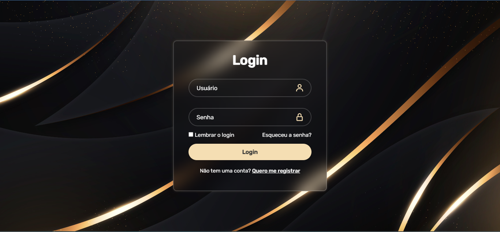

# Trabalho de Programação WEB II - PHP
Fiz um projeto utilizando HTML e CSS para uma tela de login.
Adicionei a funcionalidade "login" com PHP (verificar o arquivo php).

- Justificativa da escolha: telas de login são essenciais para um site comercial. O intuito do projeto é fazer tela de login funcional, que, dado um banco de dados, consiga identificar a existência de um login e uma senha correspondente a esse login.

- Trabalho feito para a disciplina Programação WEB II
- Professora Jessica Nogueira

julho/24

## Login - CSS
Projeto "Tela de Login" feito com HTML, CSS e Boxicons.
Feito em Dez/2023

